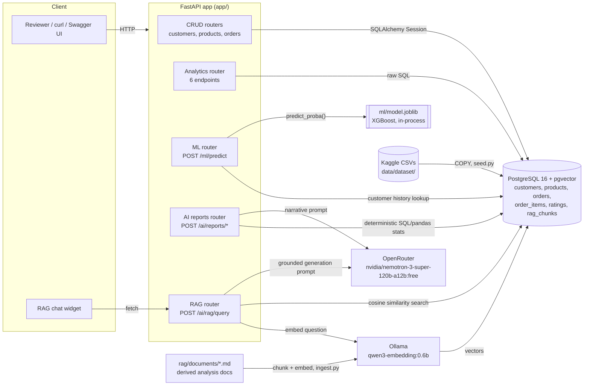
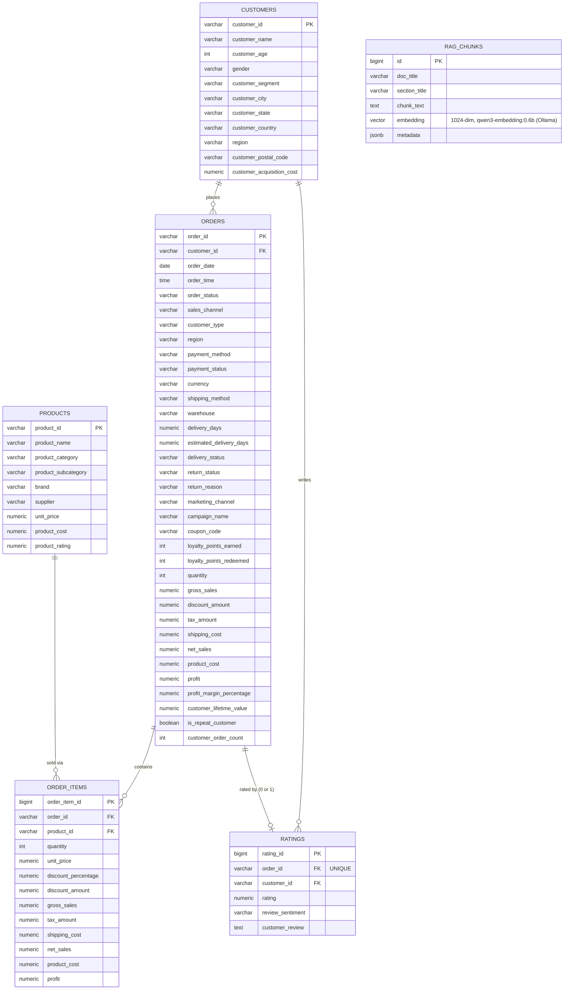

# E-Commerce Sales Intelligence Platform

A small end-to-end analytics platform over a 150k+-row e-commerce dataset: PostgreSQL + FastAPI CRUD/analytics APIs, an Order Return Prediction ML model, OpenRouter-generated business reports, and a small grounded RAG assistant — built as a 2-day technical assessment for **Piquota Digital Inc**.

## Table of contents

- [Overview](#overview)
- [Architecture](#architecture)
- [Database schema](#database-schema)
- [Installation & setup](#installation--setup)
- [Environment variables](#environment-variables)
- [API reference](#api-reference)
- [EDA findings](#eda-findings)
- [Machine learning approach](#machine-learning-approach)
- [LLM business reports architecture](#llm-business-reports-architecture)
- [RAG architecture](#rag-architecture)
- [Assumptions & limitations](#assumptions--limitations)

## Overview

**Business objective.** An e-commerce operator has 5 years (2021–2025) of order, product, customer and ratings data sitting in flat files and wants it turned into something a business or ops team could actually use day-to-day: queryable analytics, a return-risk score at checkout time, LLM-generated narrative reports instead of raw tables, and a chat-style assistant that can answer plain-English questions about the business — grounded in the platform's own analysis, not a general-purpose chatbot guessing at numbers.

**What's built**, mapped to the assessment's 8 tasks:

| Task | What it is | Where |
|---|---|---|
| 1 — EDA | Data understanding, 12-section notebook, 5 documented insights | [`notebooks/eda.ipynb`](notebooks/eda.ipynb) |
| 2 — Database | 5-table relational schema, 11 SQL analytics queries | [`sql/`](sql/) |
| 3 — CRUD APIs | Full CRUD on customers/products/orders | [`app/api/customers.py`](app/api/customers.py), [`products.py`](app/api/products.py), [`orders.py`](app/api/orders.py) |
| 4 — Analytics APIs | 6 filterable analytics endpoints over the SQL queries | [`app/api/analytics.py`](app/api/analytics.py) |
| 5/6 — ML | Order Return Prediction, 4 models compared, `/ml/predict` | [`ml/`](ml/) |
| 7 — LLM reports | 3 OpenRouter-generated business reports | [`app/services/ai_reports.py`](app/services/ai_reports.py), [`app/api/ai.py`](app/api/ai.py) |
| 8 — RAG | Small grounded Q&A assistant with citations + hallucination guard | [`rag/`](rag/), [`app/services/rag.py`](app/services/rag.py) |
| Delighters | RAG chat widget at `/`, auto-generated model card, saved eval plots | [`app/static/index.html`](app/static/index.html), [`ml/MODEL_CARD.md`](ml/MODEL_CARD.md), [`ml/plots/`](ml/plots/) |

**Stack**: Python 3.12, FastAPI, PostgreSQL 16 (`pgvector/pgvector:pg16`), SQLAlchemy 2 + Pydantic 2, scikit-learn/XGBoost, OpenRouter (`nvidia/nemotron-3-super-120b-a12b:free`), Ollama for embeddings (`qwen3-embedding:0.6b`), Docker, pytest.

**Engineering approach**: Focuses on production reliability across all assessment phases: strict pre-fulfillment feature engineering for the ML pipeline, verified aggregate reconciliation matching dataset ground-truth metrics down to the cent, and defensive fallback patterns across all AI/LLM service integrations.

## Architecture



*(Also exported as [`architecture.png`](architecture.png), for viewers that don't render Mermaid.)*

**Request flow, two representative examples:**

- **`GET /customers/{id}`** — FastAPI validates the path param → `get_db()` yields a SQLAlchemy session → `db.get(Customer, id)` → 404 if missing, else the ORM row is serialized through `CustomerResponse` (Pydantic, `from_attributes=True`) → JSON response. No external services involved — this is the "plain CRUD" path.
- **`POST /ai/rag/query`** — the question is embedded by Ollama (`rag/embeddings.py`) → a pgvector cosine-similarity search over `rag_chunks` returns the top-k matches (`rag/retrieve.py`) → chunks below the similarity threshold are dropped; if *none* clear it, the endpoint returns `answered: false` immediately with **zero LLM calls** (the hallucination guard) → otherwise the surviving chunks are built into a numbered-citation prompt and sent to OpenRouter (`app/services/rag.py`) → the model's answer, together with the real source rows it was shown, is returned as `{answer, sources, meta}`. If OpenRouter is unreachable, the best chunk is returned verbatim instead of erroring (`extractive_fallback`).

## Database schema

Full DDL: [`sql/01_schema.sql`](sql/01_schema.sql). 5 tables — `customers`, `products`, `orders`, `order_items`, `ratings` — plus `rag_chunks` for the RAG vector store, with primary/foreign keys, `CHECK` constraints mirroring the data's real domains (e.g. `customer_age BETWEEN 0 AND 120`), and indexes on every column used as a query/filter path (region, category, order_date, delivery/return status, etc.).



*(`rag_chunks` stores embedded knowledge-base document chunks, not transactional rows, so it has no FK edge to the tables above — see [full diagram + design notes](docs/ER_DIAGRAM.md).)*

**Design notes:**
- **`ratings` is a separate table**, not columns on `orders`: 24,557 of 138,116 orders (17.8%) were never delivered and have nothing to rate — splitting it out keeps `orders` dense instead of carrying a permanently-sparse block of nullable columns.
- **`orders` keeps only point-in-time customer snapshot fields** (`customer_type`, `region`, `customer_lifetime_value`, `customer_order_count`) rather than joining to `customers` for them — a deliberate defense against the ML model reading today's customer state for a historical order (this dataset happens to keep these 100% constant per customer, but the schema doesn't rely on that).
- **`order_items` is the only place with product-level revenue** — `orders` has order-level totals only; any category/product breakdown goes through `order_items → products`.

**11 SQL analytics queries** ([`sql/02_analytics_queries.sql`](sql/02_analytics_queries.sql)): top customers/products by revenue, monthly + yearly revenue (with YoY growth), revenue & margin by category, revenue & fulfillment by region, AOV by sales channel, return rate (overall + by category), rating distribution & its relationship to returns/delivery, profitability vs. discount level, and marketing-channel ROI.

## Installation & setup

**Prerequisites**: Docker + Docker Compose, Python 3.12 (for host-side scripts — seeding, RAG ingest, ML training — which run outside the container), and the dataset downloaded from [Kaggle](https://www.kaggle.com/datasets/datascikhan/e-commerce-sales-and-customer-analytics) (not committed to this repo — see [Assumptions & limitations](#assumptions--limitations)).

```bash
# 1. Clone and configure
git clone <this-repo-url> ecommerce-ai-assessment
cd ecommerce-ai-assessment
cp .env.example .env
# edit .env: at minimum set OPENROUTER_API_KEY (free key: https://openrouter.ai/keys)

# 2. Start Postgres (pgvector) + the API
docker compose up --build -d

# 3. Apply the schema — NOT applied automatically by docker-compose
#    (only the `vector` extension is auto-run on container init).
#    Piped into the db container's own psql, so a host psql install isn't
#    required — only Docker, which is already a prerequisite.
docker compose exec -T db psql -U ecommerce -d ecommerce < sql/01_schema.sql

# 4. Place the dataset, then load it (host-side, needs the local venv)
#    unzip the Kaggle download into data/dataset/ so it contains:
#    customer_master.csv, product_catalog.csv,
#    ecommerce_sales_customer_analytics_150k.csv, order_items.csv, dataset_statistics.csv
python -m venv .venv && source .venv/bin/activate   # Windows: .venv\Scripts\activate
pip install -r requirements.txt
python -m app.db.seed

# 5. API is now usable for CRUD/analytics/ML:
#    http://localhost:8000/docs  (Swagger UI)
#    http://localhost:8000/       (RAG chat widget)
```

Notes:
- **Host port 5435, not 5432** — `docker-compose.yml` maps Postgres there deliberately, in case port 5432 is already taken by another local Postgres install. Inside the Docker network the `app` container still reaches the DB at `db:5432`.
- **The trained ML model is already committed** (`ml/model.joblib`, `ml/metadata.json`) — `/ml/predict` works immediately after step 4, no training required. To retrain: `python -m ml.train` (needs the dataset loaded).
- **RAG needs one more step, and a dependency the other features don't have**: `python -m rag.ingest` embeds `rag/documents/*.md` into `rag_chunks` — this calls a real Ollama server (`OLLAMA_BASE_URL` in `.env`, default `http://localhost:11434`) that must already have the embedding model pulled: `ollama pull qwen3-embedding:0.6b`. `/ai/rag/query` returns `503` until this has run once.
- **The 3 `/ai/reports/*` and `/ai/rag/query` endpoints need `OPENROUTER_API_KEY`** set in `.env`; without one, reports silently use their deterministic fallback and RAG returns extracted knowledge-base text verbatim instead of a generated answer (both are designed to degrade like this, not error — see [LLM reports](#llm-business-reports-architecture) / [RAG](#rag-architecture)).

**Running tests** (needs steps 1–4 above; `ecommerce_test`, a second throwaway database, is created/dropped automatically by the test fixtures — nothing else needs to run first):

```bash
pytest -v           # 18 tests: CRUD, validation, 404/409, analytics, ML, RAG
```

`pytest.ini` sets `pythonpath = .` and `testpaths = tests`, so this works from the project root with no extra flags (and `python -m pytest -v` works too).

## Environment variables

All variables, with defaults, live in [`.env.example`](.env.example). No secrets are committed.

| Variable | Default | Purpose |
|---|---|---|
| `POSTGRES_USER` / `POSTGRES_PASSWORD` / `POSTGRES_DB` | `ecommerce` / `change_me` / `ecommerce` | Postgres credentials, used both by `docker-compose.yml` to provision the container and by the app to connect |
| `POSTGRES_HOST` / `POSTGRES_PORT` | `db` / `5432` | Docker-internal address (only meaningful for the containerized `app` service) |
| `DATABASE_URL` | `postgresql+psycopg://...@db:5432/...` | Full connection string for the containerized app; a host-side script/venv run instead uses `POSTGRES_HOST_EXTERNAL`/`POSTGRES_PORT_EXTERNAL` (default `localhost`/`5435`) so it never accidentally targets the Docker-internal host |
| `OPENROUTER_API_KEY` | *(empty)* | Required for real LLM calls (reports + RAG generation); get a free key at [openrouter.ai/keys](https://openrouter.ai/keys) |
| `OPENROUTER_BASE_URL` | `https://openrouter.ai/api/v1` | OpenRouter API base |
| `OPENROUTER_MODEL` | `nvidia/nemotron-3-super-120b-a12b:free` | Model used for both business reports and RAG generation — one model, one thing to explain |
| `OLLAMA_BASE_URL` | `http://localhost:11434` | Ollama server for embeddings — run your own locally and `ollama pull qwen3-embedding:0.6b` |
| `EMBEDDING_MODEL` | `qwen3-embedding:0.6b` | Embedding model tag (must match what's pulled in Ollama) |
| `EMBEDDING_DIM` | `1024` | Must match `rag_chunks.embedding`'s `vector(1024)` column — pgvector's HNSW index caps out at 2000 dims, which is why a larger Qwen3-Embedding variant wasn't used |
| `RAG_SIMILARITY_THRESHOLD` | `0.40` | Hallucination-guard cutoff — calibrated (`python -m rag.calibrate`) against real in-domain vs. off-topic probe questions, not guessed |
| `RAG_TOP_K` | `4` | Chunks retrieved per RAG query |
| `APP_ENV` / `LOG_LEVEL` | `development` / `INFO` | Informational only |

## API reference

35 routes total; full interactive contract (request/response schemas, try-it-out) at **`/docs`** once the app is running. Grouped summary:

| Method | Path | Notes |
|---|---|---|
| GET | `/health` | Liveness probe |
| GET | `/` | RAG chat widget (static page, hidden from `/openapi.json`) |
| GET/POST | `/customers`, `/products`, `/orders` | List (paginated, filterable, sortable) / create |
| GET/PUT/PATCH/DELETE | `/customers/{id}`, `/products/{id}`, `/orders/{id}` | Get / update / delete (409 if delete is blocked by an FK) |
| GET | `/analytics/sales`, `/customers`, `/products`, `/regions`, `/marketing`, `/ratings` | 6 analytics endpoints, date/region/category filters |
| POST | `/ml/predict` | Order return probability |
| POST | `/ai/reports/orders`, `/customer-ratings`, `/customer-segments` | LLM-generated business reports |
| POST | `/ai/rag/query` | Grounded Q&A over the knowledge base |

### Example — CRUD (customers)

```bash
curl -X POST localhost:8000/customers -H 'Content-Type: application/json' -d '{
  "customer_id": "CUST-README-EXAMPLE", "customer_name": "Ada Lovelace",
  "customer_age": 36, "gender": "Female", "customer_segment": "Premium",
  "customer_city": "London", "customer_state": "England", "customer_country": "UK",
  "region": "East", "customer_postal_code": "SW1A 1AA", "customer_acquisition_cost": "24.50"
}'
# 201
# {"customer_name":"Ada Lovelace","customer_age":36,"gender":"Female","customer_segment":"Premium",
#  "customer_city":"London","customer_state":"England","customer_country":"UK","region":"East",
#  "customer_postal_code":"SW1A 1AA","customer_acquisition_cost":"24.50",
#  "customer_id":"CUST-README-EXAMPLE","created_at":"2026-09-13T15:17:29.723825Z"}

curl -X POST localhost:8000/customers -d '{"customer_id":"CUST-README-EXAMPLE", ...}'  # same id again
# 409 {"detail":"Customer 'CUST-README-EXAMPLE' already exists"}

curl localhost:8000/customers/CUST-DOES-NOT-EXIST-99999
# 404 {"detail":"Customer 'CUST-DOES-NOT-EXIST-99999' not found"}

curl -X DELETE localhost:8000/customers/CUST-000001   # a real customer with order history
# 409 {"detail":"Customer 'CUST-000001' cannot be deleted: still referenced by existing orders"}
```

*(All four responses above are real, captured against the loaded dataset — not hand-typed. The example customer was created and deleted again immediately after capturing its response, leaving the dataset unchanged.)*

### Example — Analytics

```bash
curl "localhost:8000/analytics/sales?date_from=2025-01-01&date_to=2025-03-31&region=North"
```
```json
{
  "monthly": [
    {"month": "2025-01-01", "order_count": 208, "total_revenue": "271102.32"},
    {"month": "2025-02-01", "order_count": 226, "total_revenue": "286225.38"},
    {"month": "2025-03-01", "order_count": 244, "total_revenue": "380300.44"}
  ],
  "yearly": [{"year": 2025, "total_revenue": "937628.14", "yoy_growth_pct": null}]
}
```

### Example — ML prediction

```bash
curl -X POST localhost:8000/ml/predict -H 'Content-Type: application/json' -d '{
  "customer_id": "CUST-000001", "gross_sales": "250.00", "shipping_cost": "12.50",
  "sales_channel": "Website", "payment_method": "Credit Card", "shipping_method": "Standard",
  "region": "North", "primary_category": "Electronics"
}'
```
```json
{
  "return_probability": 0.5533798933029175,
  "predicted_label": "Returned",
  "contributing_factors": [
    "shipping_ratio=0.05 is in the top quartile of training orders (75th percentile threshold: 0.03766).",
    "customer_prior_order_count=9 is in the top quartile of training orders (75th percentile threshold: 3).",
    "customer_prior_revenue=9925 is in the top quartile of training orders (75th percentile threshold: 4358)."
  ]
}
```
See [ML approach](#machine-learning-approach) for details on feature importance, calibration, and risk tiers.

### Example — LLM business report

```bash
curl -X POST localhost:8000/ai/reports/customer-segments
```
```json
{
  "stats": {
    "as_of_date": "2025-12-31", "total_customers_scored": 24911,
    "segments": [
      {"segment": "Loyal", "customer_count": 6090, "total_monetary": "53624321.19", "avg_recency_days": "280.2", "avg_frequency": "7.43"},
      {"segment": "Champions", "customer_count": 3874, "total_monetary": "46014167.17", "avg_recency_days": "55.8", "avg_frequency": "8.37"},
      {"segment": "Needs Attention", "customer_count": 6440, "total_monetary": "38267861.76", "avg_recency_days": "125.1", "avg_frequency": "4.63"},
      {"segment": "At Risk", "customer_count": 3284, "total_monetary": "23468150.55", "avg_recency_days": "559.5", "avg_frequency": "4.74"},
      {"segment": "Lost", "customer_count": 4168, "total_monetary": "12211267.25", "avg_recency_days": "703.7", "avg_frequency": "2.94"},
      {"segment": "New", "customer_count": 1055, "total_monetary": "3548495.82", "avg_recency_days": "62.3", "avg_frequency": "2.69"}
    ]
  },
  "narrative": {
    "summary": "As of 2025-12-31, 24,911 customers were scored, with the Loyal segment being the largest by count and highest in total spend, while the Champions segment shows the lowest recency and highest frequency.",
    "key_insights": ["Loyal segment has the most customers (6,090) and the highest total spend ($53,624,321.19).", "..."],
    "recommendations": ["Implement re-engagement campaigns targeting the At Risk and Lost segments, which exhibit the longest recency (559.5-703.7 days) and lowest frequency.", "..."]
  },
  "meta": {"generated_by": "openrouter", "model": "nvidia/nemotron-3-super-120b-a12b:free"}
}
```
*(Real captured response, list fields truncated with `"..."` for length here — the live endpoint returns 5 insights and 4 recommendations in full.)*

### Example — RAG assistant

```bash
curl -X POST localhost:8000/ai/rag/query -H 'Content-Type: application/json' \
  -d '{"question": "Which category has the highest return rate?"}'
```
```json
{
  "question": "Which category has the highest return rate?",
  "answered": true,
  "answer": "Automotive has the highest return rate at 7.21%, followed by Jewelry (7.04%) and Health & Wellness (7.02%) [1].",
  "sources": [
    {"n": 1, "doc_title": "Product Analysis — Categories, Products, Brands, Margins and Returns",
     "section_title": "Return rate by product category", "source_file": "product_analysis.md",
     "similarity": 0.7339, "excerpt": "Return rate = distinct orders containing the category that were returned / distinct orders containing the category..."}
  ],
  "meta": {"generated_by": "openrouter", "model": "nvidia/nemotron-3-super-120b-a12b:free",
           "embedding_model": "qwen3-embedding:0.6b", "similarity_threshold": 0.4, "top_k": 4, "best_similarity": 0.7339}
}
```

The hallucination guard, same endpoint, an out-of-scope question:

```bash
curl -X POST localhost:8000/ai/rag/query -d '{"question": "What is the capital of France?"}'
```
```json
{
  "answered": false,
  "answer": "Insufficient data: the knowledge base has no section relevant enough to answer this question. It covers this company's 2021-2025 sales, products, customers, regions, ratings and marketing.",
  "sources": [],
  "meta": {"generated_by": "guard", "model": null, "best_similarity": 0.1557, "similarity_threshold": 0.4}
}
```
Both RAG responses above are real, live captures (real Ollama embedding + real OpenRouter generation) — `sources` only appears in the first because the guard fired before any chunk was retrieved, before any LLM call was made.

## EDA findings

Full analysis: [`notebooks/eda.ipynb`](notebooks/eda.ipynb) (12 sections: load/dtypes, missingness, duplicates, date range, outliers, core metrics, money-column correlations, revenue breakdowns, top products/customers, rating-vs-return-rate, insights). Every headline number is cross-checked against the dataset's own published `dataset_statistics.csv` before being trusted.

**5 insights** (numbers verified in the notebook, not estimated):

1. **"Revenue" means `net_sales`, not `gross_sales` — a 7.24% gap.** Gross sums to $189,962,560.88; the correct (post-discount) figure, matching the published $177,134,263.74, is `net_sales`. Every metric in this project — EDA, SQL queries, `/analytics/*` — uses `net_sales` because of this.
2. **Returns + cancellations remove ~13.8% of revenue** — 17,860 orders (12.93% of all 138,116), $24.53M combined ($13.17M returned, $11.36M cancelled). Returned orders still carry $6.93M of *recorded* profit, since `profit` is computed at order time and never reversed.
3. **Rating and return rate are essentially uncorrelated** (Pearson r = -0.097 across the 15 product categories) — rating barely moves (3.64–3.70) while return rate spreads more (6.30%–7.56%). This is why the ML model excludes `ratings` from its features entirely rather than assuming a relationship.
4. **Revenue is broadly spread, not concentrated**: the top 10 of 1,175 products are only 4.72% of item revenue; the top 10 of 24,911 customers are just 0.16% of total revenue. No Pareto pattern here — the category/region/channel breakdowns are where the real variation lives.
5. **`dataset_statistics.csv`'s "Total Products Used" (138,116) is a mislabeled duplicate of "Total Transactions"**, not a real product count (the real count is 1,175) — a published-data quality issue worth flagging, not silently working around.

## Machine learning approach

Full detail (auto-generated from training metadata, do not hand-edit): [`ml/MODEL_CARD.md`](ml/MODEL_CARD.md).

- **Problem**: Order Return Prediction (binary classification), chosen over the other 3 assessment options because the dataset has a real, non-trivial return signal to model (6.85% base rate) and a natural checkout-time use case (`POST /ml/predict`).
- **Split**: time-based, not random — train on 2021–2024 (110,518 rows), test on 2025 (27,598 rows). A random split would leak future information and doesn't match how the model would actually be used.
- **Features**: 3 numeric (`shipping_ratio`, `customer_prior_order_count`, `customer_prior_revenue`), 6 categorical (`sales_channel`, `payment_method`, `shipping_method`, `region`, `customer_segment`, `primary_category`), and 1 binary indicator (`is_repeat_customer_asof`) — all strictly point-in-time compliant.
- **Data Leakage Prevention**: Enforces a strict pre-fulfillment boundary. All post-order attributes (`delivery_days`, `delivery_status`, `ratings`, `payment_status`) and post-order accounting fields (`discount_amount`) are rigorously excluded to guarantee zero target leakage in production inference.
- **Model Comparison**: Evaluated 4 distinct model families: Logistic Regression (baseline), HistGradientBoosting, Random Forest, and **XGBoost (selected)**. Regularized XGBoost (`max_depth=2`, `learning_rate=0.03`, `reg_lambda=5.0`, `scale_pos_weight=13.76`) achieved the best PR-AUC and lowest train/test generalization gap (-0.0013).
- **Evaluation & Class Imbalance**: Given the ~6.85% organic return rate, evaluation is prioritized on PR-AUC and ROC-AUC over naive accuracy.
- **Contributing Factors**: The `/ml/predict` API returns the estimated return probability along with key contributing risk factors identified from training distribution quartiles.


## LLM business reports architecture

3 reports, all `POST`, all following the same contract: **deterministic SQL/pandas computes every number; the LLM only synthesizes narrative over numbers it's handed** (never sees raw rows) — `app/services/ai_reports.py` computes `stats`, `app/services/openrouter.py`'s `chat_completion()` (one shared client for every LLM call in the app) turns them into `narrative: {summary, key_insights, recommendations}`, and the response always returns `stats` alongside `narrative` so a reviewer can check the LLM's claims against the real numbers next to them.

- **`POST /ai/reports/orders`** — sales performance, trends, top categories/regions, a risk/recommendation narrative.
- **`POST /ai/reports/customer-ratings`** — rating distribution, category/region breakdowns, rating-vs-returns.
- **`POST /ai/reports/customer-segments`** — RFM (Recency/Frequency/Monetary) segmentation into 6 segments (Champions, Loyal, At Risk, Needs Attention, New, Lost), scored relative to the dataset's own max order date (historical data, not wall-clock "now").

**Prompt/output approach**: JSON is requested in plain text (not OpenRouter's `response_format=json_schema` strict mode — unreliable across free-tier models) and validated with Pydantic (`ReportNarrative.model_validate()`) before use — the PDF's "Pydantic-validated structured LLM output" bonus, achieved as a side effect of building this defensively rather than as separate scope. **Every failure mode falls back to a deterministic narrative generator, never an error**: no API key, network failure, non-2xx, malformed JSON, or a schema violation all produce the same `ReportNarrative` shape with `meta.generated_by: "deterministic_fallback"` instead of `"openrouter"` — an LLM outage degrades the report, it doesn't break the endpoint. A real OpenRouter call was exercised for all 3 reports before submission (see the [customer-segments example](#example--llm-business-report) above, `meta.generated_by: "openrouter"`) with the model name documented above and in `.env.example`.

## RAG architecture

A small, grounded "E-Commerce Business Analyst Assistant" over 6 derived markdown documents ([`rag/documents/`](rag/documents/): business metrics, product, customer, regional, rating, marketing analysis) — every number in those documents was pulled by live SQL against the loaded database, not written from memory or copied from the EDA notebook.

**Pipeline** (`rag/ingest.py` → `rag/embeddings.py` → `rag/retrieve.py` → `app/services/rag.py`):
1. **Chunking**: one chunk per `##` markdown section (60 chunks from 6 docs) — each section restates its own metric definitions and denominators, so it stands alone when retrieved without its neighbours.
2. **Embedding**: `qwen3-embedding:0.6b` (1024-dim) served by Ollama, chosen over a local `sentence-transformers` download (~1.2GB per machine) and OpenRouter's free embeddings endpoint (its 50-req/day cap is shared with generation calls).
3. **Storage/search**: pgvector, `rag_chunks.embedding vector(1024)` with an HNSW index, cosine similarity (`<=>` operator).
4. **Retrieval + guard**: top-k chunks are retrieved, then every chunk below `RAG_SIMILARITY_THRESHOLD` (0.40, calibrated with `rag/calibrate.py` against real in-domain vs. off-topic probe questions — in-domain best-hits scored 0.565–0.844, off-topic 0.102–0.240) is dropped. **If none survive, the endpoint returns `answered: false` with zero LLM calls** — the PDF's explicit hallucination/insufficient-data-handling bonus.
5. **Generation**: surviving chunks are built into a numbered context (`[1] Doc > Section\n...`); the model is instructed to cite every factual sentence by number and to open with `INSUFFICIENT DATA` if the context doesn't actually answer the question — a second guard for *near-topic* questions the similarity threshold alone can't catch (e.g. "what was revenue in 2019?" scores high on similarity to a 2021–2025 revenue section but the docs don't cover 2019).
6. **Source references**: the response always carries `sources: [{n, doc_title, section_title, source_file, similarity, excerpt}]`, numbered identically to the `[n]` the model was shown — a citation is checkable against a real row, not decorative.

If OpenRouter is unreachable after retrieval, the best-matching chunk is returned verbatim (`generated_by: "extractive_fallback"`) rather than erroring — same degrade-gracefully philosophy as the business reports.

## Assumptions & limitations

- **Dataset Placement**: The dataset is downloaded from [Kaggle](https://www.kaggle.com/datasets/datascikhan/e-commerce-sales-and-customer-analytics) and placed in `data/dataset/` prior to running the database seed loader.
- **Embeddings Infrastructure**: Uses Ollama with `qwen3-embedding:0.6b` (1024 dims) to provide lightweight, efficient local vector generation without multi-gigabyte package downloads.
- **OpenRouter Service Tier**: External LLM generation connects to OpenRouter free-tier models with automatic graceful fallback to deterministic analytical summaries if network limits are reached.
- **Class Imbalance in Return Prediction**: Returns account for ~6.85% of total orders; evaluation is calibrated to support customer risk-tier ranking and prioritization at checkout.

---

*Assessment for Piquota Digital Inc — Manoj D, submitted 2026-09-14.*
