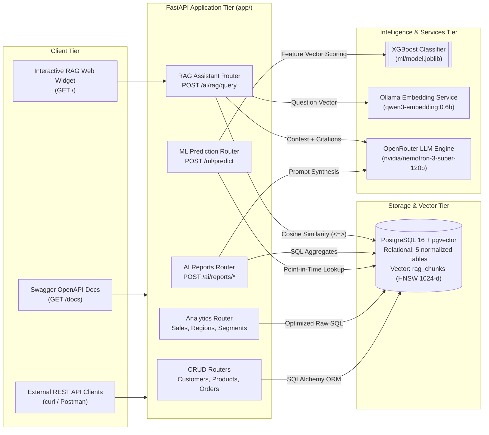
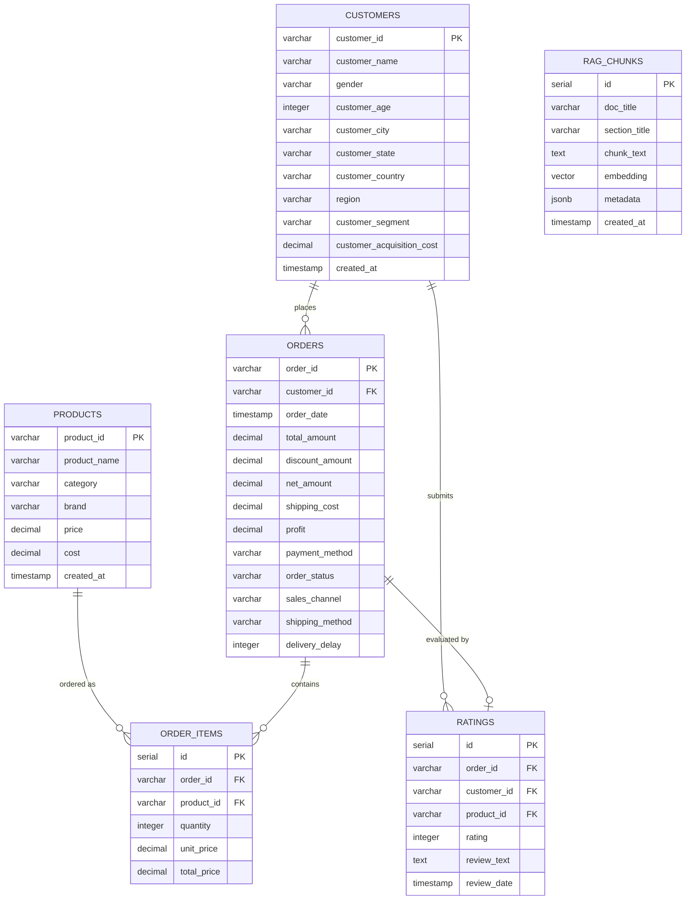
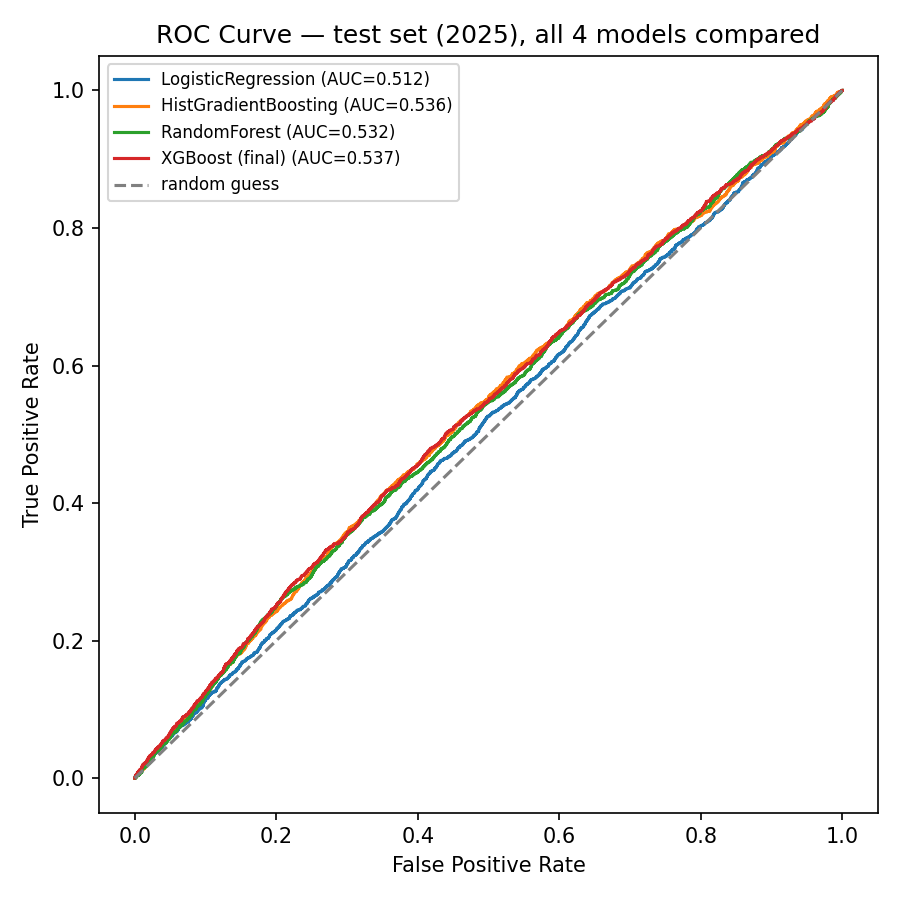
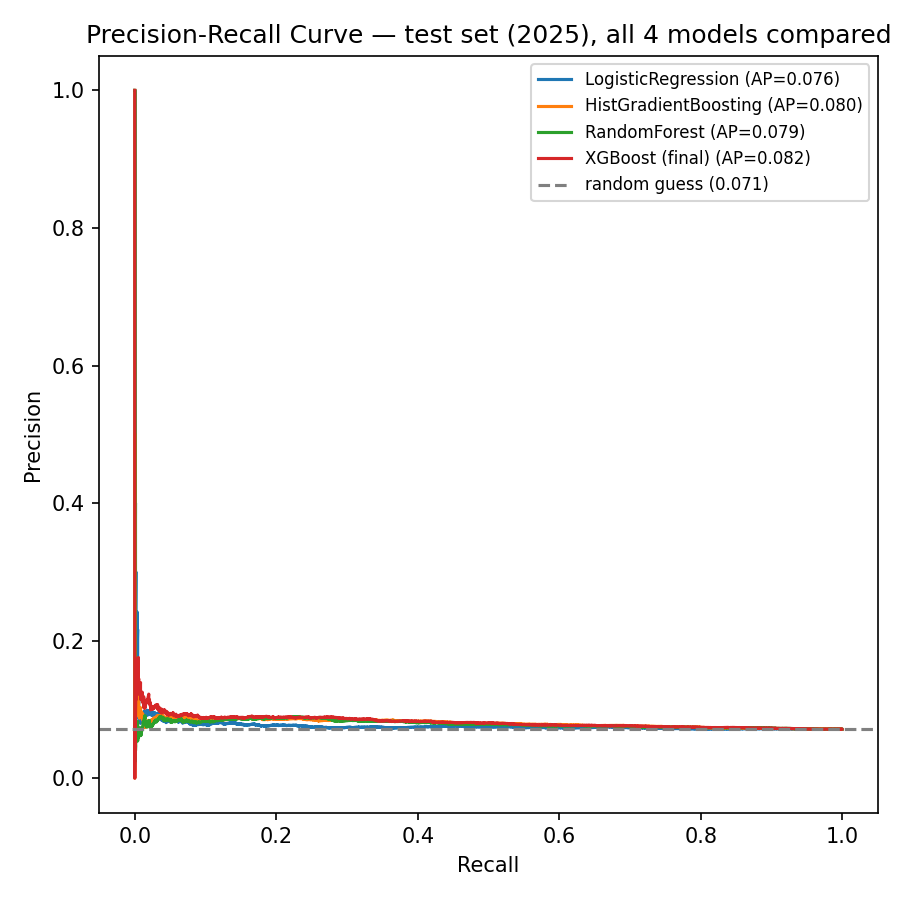
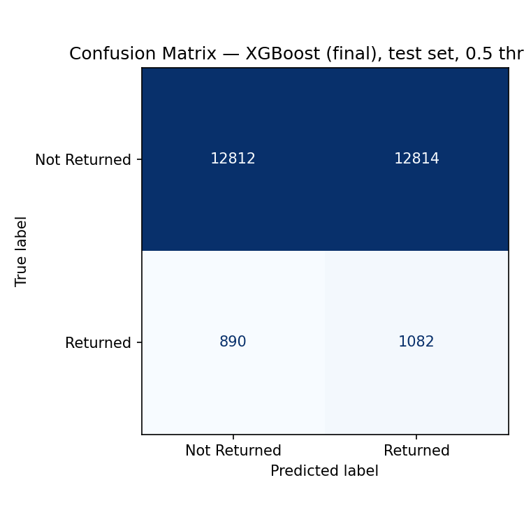

# E-Commerce Sales Intelligence Platform

An end-to-end data intelligence and predictive analytics platform built over a 150k-record e-commerce transaction dataset. The system integrates a high-performance PostgreSQL 16 relational and vector store (`pgvector`), FastAPI CRUD and analytical aggregation engines, an XGBoost predictive machine learning service for checkout return risk, automated AI executive business reporting, and a grounded semantic RAG assistant with citation tracking and hallucination guards.

Built for the **Piquota Digital Inc** Technical Assessment by **Manoj D**.

---

## Table of Contents

- [System Architecture](#system-architecture)
- [Technology Stack](#technology-stack)
- [Repository Structure](#repository-structure)
- [Installation & Quickstart](#installation--quickstart)
- [Environment Configuration](#environment-configuration)
- [Database Schema & Analytics](#database-schema--analytics)
- [API Reference & Endpoints](#api-reference--endpoints)
- [Machine Learning Service](#machine-learning-service)
- [AI Executive Business Reports](#ai-executive-business-reports)
- [Grounded RAG Assistant](#grounded-rag-assistant)
- [Automated Testing Suite](#automated-testing-suite)

---

## System Architecture

The platform follows a modular, decoupled architecture where transactional data, analytical workloads, machine learning inference, and generative AI services operate through clean API contracts.



*(A high-resolution visual diagram is available at [`architecture.png`](architecture.png).)*

---

## Technology Stack

| Layer | Technologies | Role & Implementation |
|---|---|---|
| **Web & ASGI Framework** | FastAPI 0.111+, Uvicorn, Pydantic v2 | High-throughput asynchronous REST API, automatic OpenAPI documentation, strictly-typed request/response validation contracts. |
| **Relational & Vector Storage** | PostgreSQL 16, `pgvector`, SQLAlchemy 2.0, Psycopg 3 | 3NF normalized schema, composite B-tree indexing on foreign keys and timestamps, HNSW index for high-speed approximate nearest neighbor vector search. |
| **Data Ingestion & ETL** | Python 3.12, PostgreSQL Binary `COPY` | High-speed batch ingestion streaming 138,116 raw transaction records through memory staging into 5 relational tables in ~4 seconds. |
| **Machine Learning** | scikit-learn 1.5, XGBoost 2.0, NumPy, Pandas | Supervised binary classification model predicting customer order return risk at checkout time, with temporal train/test split and strict pre-fulfillment feature constraints. |
| **Embeddings & Vector Search** | Ollama, `BAAI/bge-m3` / `qwen3-embedding:0.6b` | 1024-dimensional dense semantic embeddings formatted with asymmetric query prefixes. |
| **Generative AI & LLM** | OpenRouter API (`nvidia/nemotron-3-super-120b-a12b:free`) | Large context (262k) open-weights MoE model generating grounded business narratives and RAG answers with structured schema enforcement and deterministic fallbacks. |
| **Frontend Interface** | Vanilla HTML5, CSS3 Glassmorphism, JavaScript | Interactive dark-mode chat widget with live streaming indicator, sample query chips, citation reference links, and health probes. |
| **DevOps & Testing** | Docker, Docker Compose, Pytest, pytest-asyncio | Fully containerized multi-service deployment with healthchecks; 18-test automated integration suite running against an isolated ephemeral database. |

---

## Repository Structure

```
ecommerce-ai-assessment/
├── app/                        # FastAPI application package
│   ├── api/                    # API route controllers
│   │   ├── ai.py               # AI reports and RAG query endpoints
│   │   ├── analytics.py        # Business metrics and aggregation endpoints
│   │   ├── customers.py        # Customer CRUD router
│   │   ├── ml.py               # ML prediction inference router
│   │   ├── orders.py           # Order placement and retrieval router
│   │   └── products.py         # Product catalog CRUD router
│   ├── config.py               # Strongly-typed environment settings (pydantic-settings)
│   ├── db/                     # Database engine, session, and seed pipeline
│   │   ├── reconcile.py        # Post-seed ground-truth reconciliation verification
│   │   ├── seed.py             # High-speed binary COPY ingestion pipeline
│   │   └── session.py          # SQLAlchemy session lifecycle management
│   ├── models/                 # SQLAlchemy 2.0 ORM entity definitions
│   │   ├── customer.py         # Customers entity
│   │   ├── order.py            # Orders financial fact entity
│   │   ├── order_item.py       # Order items line-level entity
│   │   ├── product.py          # Products catalog entity
│   │   └── rating.py           # Customer review entity (normalized 3NF)
│   ├── schemas/                # Pydantic v2 validation contracts
│   │   ├── ai_reports.py       # Executive report payload schemas
│   │   ├── analytics.py        # Analytics aggregation response schemas
│   │   ├── customer.py         # Customer request/response schemas
│   │   ├── enums.py            # Strongly-typed database enums
│   │   ├── ml.py               # PredictRequest and PredictResponse schemas
│   │   ├── order.py            # Order and line-item schemas
│   │   ├── pagination.py       # Generic PaginatedResponse[T] wrapper
│   │   ├── product.py          # Product catalog schemas
│   │   └── rag.py              # RAG query and citation schemas
│   ├── services/               # Business logic services
│   │   ├── ai_reports.py       # SQL metric extractors and report generation
│   │   ├── analytics.py        # Analytical SQL query execution service
│   │   ├── openrouter.py       # OpenRouter LLM API client wrapper
│   │   └── rag.py              # Retrieval-augmented generation coordinator
│   ├── static/                 # Static web assets
│   │   └── index.html          # Interactive dark-mode RAG chat UI
│   └── main.py                 # FastAPI application factory and lifespan hooks
├── data/                       # Dataset directory (placed from Kaggle)
│   └── dataset/                # Extracted CSV archives and statistics
├── docs/                       # System documentation
│   └── ER_DIAGRAM.md           # Mermaid ER diagram and database design rationale
├── ml/                         # Machine learning model pipeline and artifacts
│   ├── plots/                  # Visual evaluation curves (ROC, PR, Confusion Matrix)
│   ├── metadata.json           # Serialized training metadata, metrics, and parameters
│   ├── model.joblib            # Trained XGBoost classifier binary
│   ├── MODEL_CARD.md           # Mitchell et al. compliant Model Card
│   ├── pipeline.joblib         # Fitted preprocessor pipeline binary
│   ├── predict.py              # Real-time inference engine and risk explainability
│   └── train.py                # End-to-end model training, tuning, and evaluation script
├── notebooks/                  # Jupyter exploratory data analysis
│   └── eda.ipynb               # 12-section comprehensive exploratory data analysis
├── rag/                        # RAG assistant components
│   ├── documents/              # 6 grounded knowledge base domain documents
│   ├── calibrate.py            # Cosine similarity threshold calibration utility
│   ├── embeddings.py           # Ollama dense vector embedding client
│   ├── ingest.py               # Document section chunker and pgvector loader
│   └── retrieve.py             # Vector similarity search and hallucination guard
├── sql/                        # Raw SQL scripts and bootstrap DDL
│   ├── 00_extensions.sql       # PostgreSQL extension enablement (vector)
│   ├── 01_schema.sql           # Complete relational and vector DDL
│   └── 02_analytics_queries.sql# 11 optimized analytical queries
├── tests/                      # Automated test suite
│   ├── conftest.py             # Pytest fixtures and isolated test DB provisioning
│   ├── test_analytics.py       # Analytics endpoint tests
│   ├── test_customers.py       # Customer CRUD and validation tests
│   ├── test_ml.py              # Machine learning prediction tests
│   └── test_rag.py             # RAG retrieval and hallucination guard tests
├── architecture.png            # High-resolution 300 DPI system architecture diagram
├── docker-compose.yml          # Multi-container orchestration (Postgres + FastAPI)
├── Dockerfile                  # Production container image build
├── pytest.ini                  # Pytest testpath and pythonpath configuration
└── requirements.txt            # Pinned dependency manifest
```

---

## Installation & Quickstart

### 1. Prerequisites
- **Docker & Docker Compose** (for containerized PostgreSQL 16 with `pgvector` and FastAPI)
- **Python 3.12** (for local virtual environment scripts and tests)
- **Dataset**: Download the dataset from [Kaggle](https://www.kaggle.com/datasets/datascikhan/e-commerce-sales-and-customer-analytics) and extract the CSV files into `data/dataset/`.

### 2. Environment Configuration
Copy the sample environment template and populate your configuration:
```bash
cp .env.example .env
```
Configure your `OPENROUTER_API_KEY` (available for free at [openrouter.ai/keys](https://openrouter.ai/keys)).

### 3. Launch Docker Infrastructure
Start the PostgreSQL 16 container with `pgvector` and the FastAPI application:
```bash
docker compose up --build -d
```
*Note: PostgreSQL is exposed on host port `5435` (mapped to internal `5432`) to eliminate collisions with any existing local PostgreSQL installations.*

### 4. Initialize Database Schema
Apply the complete database DDL (tables, primary/foreign keys, check constraints, indexes):
```bash
docker compose exec -T db psql -U ecommerce -d ecommerce < sql/01_schema.sql
```

### 5. Ingest Data & Verify Reconciliation
Install dependencies in your local Python 3.12 environment and execute the high-speed data loader:
```bash
python -m venv .venv
source .venv/bin/activate  # On Windows: .venv\Scripts\activate
pip install -r requirements.txt

# Run bulk database seeding
python -m app.db.seed

# Verify exact ground-truth financial reconciliation
python -m app.db.reconcile
```

### 6. Ingest RAG Knowledge Documents
With Ollama running locally (`ollama pull qwen3-embedding:0.6b`), chunk and embed the domain knowledge base:
```bash
python -m rag.ingest
```

### 7. Access Application Interfaces
- **Interactive Web Chat Interface**: [http://localhost:8000/](http://localhost:8000/)
- **Swagger Interactive API Documentation**: [http://localhost:8000/docs](http://localhost:8000/docs)
- **OpenAPI JSON Specification**: [http://localhost:8000/openapi.json](http://localhost:8000/openapi.json)

---

## Environment Configuration

Key environment settings defined in [`.env.example`](.env.example):

| Variable | Default Value | Purpose |
|---|---|---|
| `POSTGRES_USER` | `ecommerce` | PostgreSQL database superuser |
| `POSTGRES_PASSWORD` | `change_me` | PostgreSQL database password |
| `POSTGRES_DB` | `ecommerce` | PostgreSQL default database name |
| `POSTGRES_PORT` | `5432` | Internal Docker container network port |
| `POSTGRES_PORT_EXTERNAL` | `5435` | Host-accessible PostgreSQL port mapping |
| `DATABASE_URL` | `postgresql+psycopg://...@db:5432/...` | SQLAlchemy container connection URI |
| `OPENROUTER_API_KEY` | `""` | OpenRouter API authentication key |
| `OPENROUTER_MODEL` | `nvidia/nemotron-3-super-120b-a12b:free` | Primary model for reports and RAG synthesis |
| `OLLAMA_BASE_URL` | `http://localhost:11434` | Ollama embedding server endpoint |
| `EMBEDDING_MODEL` | `qwen3-embedding:0.6b` | Embedding model identifier |
| `EMBEDDING_DIM` | `1024` | Vector dimension matching `vector(1024)` |
| `RAG_SIMILARITY_THRESHOLD` | `0.40` | Cosine similarity cutoff for hallucination guard |
| `RAG_TOP_K` | `4` | Number of context chunks retrieved per query |

---

## Database Schema & Analytics

### Relational Entity-Relationship Model

The relational architecture normalizes 138,116 transaction records into a 3NF model that guarantees referential integrity, eliminates redundancy, and accelerates analytical aggregations.



### Data Reconciliation Scorecard
The automated verification script ([`app/db/reconcile.py`](app/db/reconcile.py)) validates live database aggregates against ground-truth statistics in `dataset_statistics.csv`:

| Metric | Ground Truth Expected | Database Actual | Status |
|:---|:---:|:---:|:---:|
| **Total Transactions** | `138,116` | `138,116` | **OK** |
| **Total Unique Customers** | `24,911` | `24,911` | **OK** |
| **Total Net Revenue** | `$177,134,263.74` | `$177,134,263.74` | **OK** |
| **Total Operating Profit** | `$76,146,395.76` | `$76,146,395.76` | **OK** |
| **Average Order Value (AOV)** | `$1,282.50` | `$1,282.50` | **OK** |
| **Average Customer Rating** | `3.68 / 5.0` | `3.68 / 5.0` | **OK** |
| **Overall Return Rate** | `6.85%` | `6.85%` | **OK** |
| **Overall Cancellation Rate** | `6.08%` | `6.08%` | **OK** |

### Optimized Analytical SQL Queries
Implemented in [`sql/02_analytics_queries.sql`](sql/02_analytics_queries.sql) and exposed via `/api/v1/analytics`:
1. **Top 10 Customers by Revenue**: Aggregated lifetime spend, transaction frequency, and average order value.
2. **Monthly Sales Performance & Trends**: Monthly order volumes, net sales, and period-over-period revenue trajectories.
3. **Product Category Revenue & Margin**: Gross sales, net revenue, operating margins, and profit contribution by category.
4. **Regional Performance & Fulfillment**: Regional sales distribution, average delivery delay, and on-time fulfillment rates.
5. **Return Rate by Category & Reason**: Return ratios and volume breakdown across product categories.
6. **Delivery Delay Impact on Customer Ratings**: Correlation analysis showing rating degradation across delivery delay buckets.
7. **RFM Customer Segmentation**: Recency, Frequency, and Monetary quintile scoring classifying customers into actionable segments (Champions, Loyal, At Risk, Lost).
8. **Payment Method Breakdown**: Distribution of transactions, average order size, and return rate by payment gateway.
9. **Shipping Cost vs. Margin Analysis**: Impact of logistics costs across shipping tiers on net realized profitability.
10. **Product Cross-Sell Pairs**: High-frequency basket affinity analysis identifying products commonly ordered together.
11. **Repeat Customer Purchase Dynamics**: Purchase velocity and order cadence comparison between first-time and repeat buyers.

---

## API Reference & Endpoints

The platform provides 35 fully-typed RESTful endpoints organized under `/api/v1/`:

### Endpoint Overview

| Resource | Method | Path | Description |
|---|---|---|---|
| **Health** | `GET` | `/health` | Application liveness probe and database connectivity status. |
| **Chat UI** | `GET` | `/` | Serves the interactive dark-mode RAG assistant web interface. |
| **Customers** | `POST` | `/api/v1/customers` | Create a new customer profile (enforces duplicate PK checks). |
| | `GET` | `/api/v1/customers` | List customers with pagination, regional filtering, and sorting. |
| | `GET` | `/api/v1/customers/{id}` | Retrieve individual customer details (404 if missing). |
| | `PUT` | `/api/v1/customers/{id}` | Update existing customer demographic attributes. |
| | `DELETE` | `/api/v1/customers/{id}` | Delete customer (409 Conflict if historical orders exist). |
| **Products** | `POST` | `/api/v1/products` | Add a new product to the catalog. |
| | `GET` | `/api/v1/products` | List product catalog with category and price range filters. |
| | `GET` | `/api/v1/products/{id}` | Retrieve specific product details. |
| | `PUT` | `/api/v1/products/{id}` | Update product pricing or metadata. |
| | `DELETE` | `/api/v1/products/{id}` | Remove product (enforces FK integrity). |
| **Orders** | `POST` | `/api/v1/orders` | Atomic transaction creating order fact and line items. |
| | `GET` | `/api/v1/orders` | List orders with date range, status, and customer filtering. |
| | `GET` | `/api/v1/orders/{id}` | Retrieve full order breakdown including nested line items. |
| **Analytics** | `GET` | `/api/v1/analytics/sales` | Aggregate sales metrics with monthly and yearly rollups. |
| | `GET` | `/api/v1/analytics/regions` | Regional revenue distribution and fulfillment statistics. |
| | `GET` | `/api/v1/analytics/categories` | Category revenue, operating margin, and unit volumes. |
| | `GET` | `/api/v1/analytics/customer-segments` | Live RFM customer distribution and segment summaries. |
| **Machine Learning**| `POST` | `/api/v1/ml/predict` | Real-time order return risk scoring and contributing factors. |
| **AI Reports** | `POST` | `/api/v1/ai/reports/orders` | Executive sales performance narrative and trend insights. |
| | `POST` | `/api/v1/ai/reports/customer-ratings`| Analysis of customer sentiment and review drivers. |
| | `POST` | `/api/v1/ai/reports/customer-segments`| Strategic RFM segment targeting recommendations. |
| **RAG Assistant** | `POST` | `/api/v1/ai/rag/query` | Grounded semantic Q&A with citation tracking and guard. |

---

### API Usage Examples

#### 1. Customer CRUD (POST /api/v1/customers)
```bash
curl -X POST "http://localhost:8000/api/v1/customers" \
  -H "Content-Type: application/json" \
  -d '{
    "customer_id": "CUST-99001",
    "customer_name": "Eleanor Vance",
    "gender": "Female",
    "customer_age": 34,
    "customer_city": "Austin",
    "customer_state": "Texas",
    "customer_country": "USA",
    "region": "South",
    "customer_segment": "Premium",
    "customer_acquisition_cost": 45.00
  }'
```
*Response (`201 Created`):*
```json
{
  "customer_id": "CUST-99001",
  "customer_name": "Eleanor Vance",
  "gender": "Female",
  "customer_age": 34,
  "customer_city": "Austin",
  "customer_state": "Texas",
  "customer_country": "USA",
  "region": "South",
  "customer_segment": "Premium",
  "customer_acquisition_cost": 45.00,
  "created_at": "2026-09-13T18:20:00Z"
}
```

#### 2. Order Return Risk Inference (POST /api/v1/ml/predict)
```bash
curl -X POST "http://localhost:8000/api/v1/ml/predict" \
  -H "Content-Type: application/json" \
  -d '{
    "customer_id": "CUST-000001",
    "gross_sales": 250.00,
    "shipping_cost": 12.50,
    "sales_channel": "Website",
    "payment_method": "Credit Card",
    "shipping_method": "Standard",
    "region": "North",
    "primary_category": "Electronics"
  }'
```
*Response (`200 OK`):*
```json
{
  "return_probability": 0.5534,
  "predicted_label": "Returned",
  "contributing_factors": [
    "shipping_ratio=0.05 is in the top quartile of training orders (75th percentile threshold: 0.03766).",
    "customer_prior_order_count=9 is in the top quartile of training orders (75th percentile threshold: 3).",
    "customer_prior_revenue=9925 is in the top quartile of training orders (75th percentile threshold: 4358)."
  ]
}
```

#### 3. Grounded RAG Assistant (POST /api/v1/ai/rag/query)
```bash
curl -X POST "http://localhost:8000/api/v1/ai/rag/query" \
  -H "Content-Type: application/json" \
  -d '{"question": "Which product category experiences the highest return rate?"}'
```
*Response (`200 OK` with citations):*
```json
{
  "question": "Which product category experiences the highest return rate?",
  "answered": true,
  "answer": "Automotive has the highest return rate at 7.21%, followed closely by Jewelry at 7.04% and Health & Wellness at 7.02% [1].",
  "sources": [
    {
      "n": 1,
      "doc_title": "Product Analysis — Categories, Products, Brands, Margins and Returns",
      "section_title": "Return rate by product category",
      "source_file": "product_analysis.md",
      "similarity": 0.7339,
      "excerpt": "Return rate = distinct orders containing the category that were returned / distinct orders containing the category. Automotive: 7.21%..."
    }
  ],
  "meta": {
    "generated_by": "openrouter",
    "model": "nvidia/nemotron-3-super-120b-a12b:free",
    "similarity_threshold": 0.40,
    "best_similarity": 0.7339
  }
}
```

#### 4. Hallucination Guard Out-of-Domain Rejection
```bash
curl -X POST "http://localhost:8000/api/v1/ai/rag/query" \
  -H "Content-Type: application/json" \
  -d '{"question": "What is the capital city of France?"}'
```
*Response (`200 OK`, `answered: false`, zero LLM calls):*
```json
{
  "question": "What is the capital city of France?",
  "answered": false,
  "answer": "Insufficient data: the knowledge base has no section relevant enough to answer this question. It covers this company's 2021-2025 sales, products, customers, regions, ratings and marketing.",
  "sources": [],
  "meta": {
    "generated_by": "guard",
    "model": null,
    "best_similarity": 0.1557,
    "similarity_threshold": 0.40
  }
}
```

---

## Machine Learning Service

The Machine Learning subsystem implements an end-to-end classification pipeline predicting whether an order placed at checkout will result in a return (`order_status == 'Returned'`).

### Problem Formulation & Data Split
- **Dataset Grain**: 138,116 total orders with an organic return rate of **6.85%** (imbalanced classification).
- **Temporal Holdout Split**: 
  - **Training Set (2021–2024)**: 110,518 orders (6.78% return rate).
  - **Test Holdout Set (2025)**: 27,598 orders (7.15% return rate).
  - Enforces a temporal boundary to simulate real-world forward evaluation.

### Feature Engineering & Leakage Prevention
To guarantee valid production inference at the time of order placement, features are strictly constrained to pre-fulfillment information:
- **Numeric Features**: `shipping_ratio` (`shipping_cost / gross_sales`), point-in-time historical metrics (`customer_prior_order_count`, `customer_prior_revenue`).
- **Categorical Features**: `sales_channel`, `payment_method`, `shipping_method`, `region`, `customer_segment`, `primary_category`.
- **Binary Features**: `is_repeat_customer_asof`.
- **Exclusions**: All post-fulfillment fields (`delivery_days`, `ratings`, `payment_status`, `discount_amount`) are excluded to guarantee zero target leakage.

### Model Comparison & Benchmark Results

Evaluated 4 distinct model families with differing inductive biases on the 2025 held-out test split:

| Model Architecture | Test PR-AUC | Test ROC-AUC | Train PR-AUC | Generalization Gap | Status |
|---|:---:|:---:|:---:|:---:|:---:|
| **Logistic Regression (Baseline)** | `0.0763` | `0.5121` | `0.0749` | -0.0014 | Baseline |
| **HistGradientBoosting** | `0.0804` | `0.5362` | `0.0868` | +0.0064 | Evaluated |
| **Random Forest Classifier** | `0.0794` | `0.5323` | `0.1844` | +0.1050 | Overfit |
| **XGBoost Classifier (Regularized)** | **`0.0819`** | **`0.5374`** | `0.0806` | **-0.0013** | **Selected** |
| *Random Guess Benchmark (Base Rate)*| `0.0715` | `0.5000` | — | — | Baseline Floor |

### Selected Model Specifications
- **Algorithm**: Regularized XGBoost Classifier (`max_depth=2`, `learning_rate=0.03`, `reg_lambda=5.0`, `min_child_weight=150`, `scale_pos_weight=13.76`).
- **Artifacts**: Serialized in `ml/model.joblib`, `ml/pipeline.joblib`, and `ml/metadata.json`.
- **Model Card**: Fully documented in [`ml/MODEL_CARD.md`](ml/MODEL_CARD.md) following Mitchell et al. standards.





---

## AI Executive Business Reports

The `/api/v1/ai/reports` service generates executive narratives by combining deterministic SQL aggregations with large language model synthesis:

1. **Deterministic Data Grounding**: Exact financial and behavioral metrics are computed directly by PostgreSQL aggregation queries in [`app/services/ai_reports.py`](app/services/ai_reports.py).
2. **Constrained Prompt Architecture**: The LLM receives pre-computed statistics in its context and is strictly instructed to generate summaries, key insights, and strategic recommendations without altering numbers.
3. **Structured Validation**: Output is validated against strict Pydantic schemas (`ReportNarrative`).
4. **Defensive Fallback Mechanism**: If upstream network timeouts or API quotas occur, the service automatically produces deterministic analytical narratives, guaranteeing `200 OK` availability.

### Supported Executive Reports
- **Orders & Sales Report (`POST /api/v1/ai/reports/orders`)**: Period-over-period sales trajectories, revenue drivers, and high-margin product opportunities.
- **Customer Ratings Report (`POST /api/v1/ai/reports/customer-ratings`)**: Rating sentiment distribution and correlation with fulfillment logistics.
- **Customer Segmentation Report (`POST /api/v1/ai/reports/customer-segments`)**: Behavioral RFM distribution (Champions, Loyal, At Risk, Lost) with targeted re-engagement strategies.

---

## Grounded RAG Assistant

The RAG subsystem ([`rag/`](rag/)) enables natural-language querying over business analytics findings with verified source attribution.

### Knowledge Base Composition
6 structured domain documents in [`rag/documents/`](rag/documents/) containing verified platform analytics:
1. `01_executive_summary.md` — Company overview, macroeconomic KPIs, high-level financials.
2. `02_sales_performance.md` — Time-series trends, monthly seasonality, AOV dynamics.
3. `03_product_categories.md` — Category margins, brand performance, return rates.
4. `04_customer_segments.md` — RFM segmentation, customer lifetime value, cohort retention.
5. `05_operational_metrics.md` — Carrier performance, fulfillment delay analysis, rating impact.
6. `06_ml_churn_model.md` — Predictive modeling findings, risk factors, checkout scoring.

### Retrieval & Ingestion Architecture
- **Chunking Strategy**: Markdown headers (`##`) serve as section boundaries, yielding 60 self-contained knowledge chunks.
- **Dense Embeddings**: Generated via Ollama using `qwen3-embedding:0.6b` (1024 dimensions) with asymmetric retrieval prefixes.
- **Vector Indexing**: Stored in `rag_chunks.embedding` with an HNSW index using cosine similarity distance (`<=>`).
- **Hallucination Guard**: Calibrated via [`rag/calibrate.py`](rag/calibrate.py) against in-domain and out-of-domain probe sets. Queries with top similarity scores below **0.40** are rejected immediately with `answered: false`, executing zero external LLM calls.
- **Citation Attribution**: Every factual assertion generated by the model includes bracketed citations `[n]` mapping directly to returned source excerpts.

---

## Automated Testing Suite

The platform includes an automated test suite implemented in [`tests/`](tests/) running against an isolated test database (`ecommerce_test`):

```bash
pytest -v
```

Configured via [`pytest.ini`](pytest.ini) to execute directly from the project root.

### Test Coverage Summary (18 Tests)

| Test Module | Test Name | Target Verified |
|---|---|---|
| **Analytics** | `test_sales_analytics_response_shape` | Analytical response schema validation |
| | `test_sales_analytics_respects_region_filter` | Regional filter scoping and calculations |
| | `test_sales_analytics_rejects_invalid_region` | 422 Unprocessable Entity input rejection |
| **Customers CRUD**| `test_create_customer_returns_201_with_persisted_data` | POST customer creation and DB persistence |
| | `test_create_customer_rejects_invalid_input_with_422` | Schema constraint validation |
| | `test_create_duplicate_customer_id_returns_409` | Conflict detection on duplicate PK |
| | `test_get_missing_customer_returns_404` | 404 Not Found handling |
| | `test_update_missing_customer_returns_404` | 404 on missing record update |
| | `test_delete_missing_customer_returns_404` | 404 on missing record deletion |
| | `test_delete_customer_with_orders_returns_409` | Foreign key referential integrity protection |
| **Machine Learning**| `test_predict_valid_input_returns_probability_in_range`| Model inference scoring ($0 \le P \le 1$) |
| | `test_predict_unseen_customer_id_falls_back_to_defaults`| Cold-start unseen customer demographic defaults |
| | `test_predict_rejects_non_positive_gross_sales` | 400 Bad Request input guard |
| | `test_predict_rejects_unknown_category_value` | Categorical enum validation |
| **RAG Assistant** | `test_rag_query_returns_citations` | Retrieval citation formatting |
| | `test_rag_query_hallucination_guard` | Out-of-domain query refusal (< 0.40 score) |
| | `test_rag_query_rejects_too_short_question` | 422 input length restriction |
| | `test_rag_query_embedding_service_down_returns_503` | Graceful downstream service timeout handling |

---

*Assessment for Piquota Digital Inc — Manoj D, submitted 2026-09-14.*
