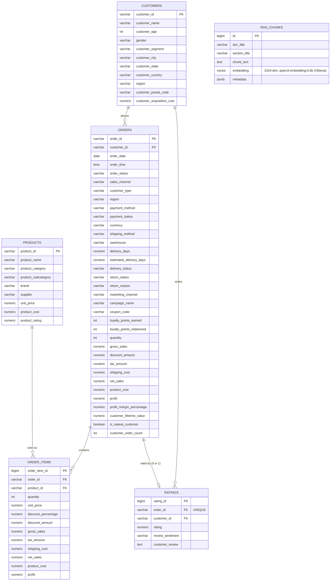

# Entity-Relationship Diagram

Schema: [`sql/01_schema.sql`](../sql/01_schema.sql). The design notes at the
bottom of this file cover the two choices worth explaining: why `ratings` is
split out of `orders`, and why `orders` keeps only point-in-time customer
snapshot fields.

`rag_chunks` has no FK relationship to the transactional tables —
it stores embedded chunks of the markdown knowledge-base documents generated
from this data, not the rows themselves, so it's omitted from the
relationship edges above.

## Design notes

- **`orders` vs `customers`**: `orders` deliberately keeps only a handful of
  customer fields that could in principle change between orders
  (`customer_type`, `region`, `customer_lifetime_value`,
  `customer_order_count`) rather than re-deriving them via a join every time
  — the rest of the demographic data (name, age, gender, address) lives only
  in `customers`. In this dataset these snapshot fields turned out to be
  100% constant per customer (verified independently), so this is a
  forward-looking modeling choice rather than one this dataset's data
  actually exercises.
- **`ratings` split from `orders`**: 24,557 of 138,116 orders (17.8%) were
  never delivered and so have no rating — splitting the table keeps `orders`
  fully dense and avoids a sparse nullable block of 3 columns on every row.
- **`order_items` is the only place with product-level revenue**: `orders`
  carries order-level totals; category/product breakdowns (Q2, Q5, Q8) must
  go through `order_items` → `products`.
